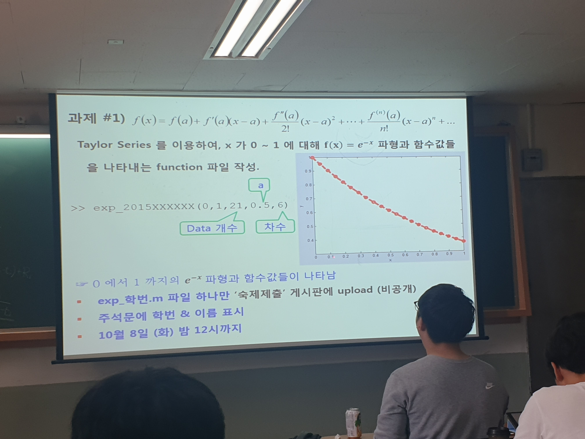

# 과제 1 Matlab Code

#### 

function exp(xmin,xmax,data,a,n)
x = linspace(xmin,xmax,data);
y = zeros(1,data);
for ncount=0:1:n
	y = y + ((-1)^(ncount) * exp(-a) * (x-a).^ncount) / factorial(ncount);
end
plot(x,y, 'r--o','linewidth',3);
end