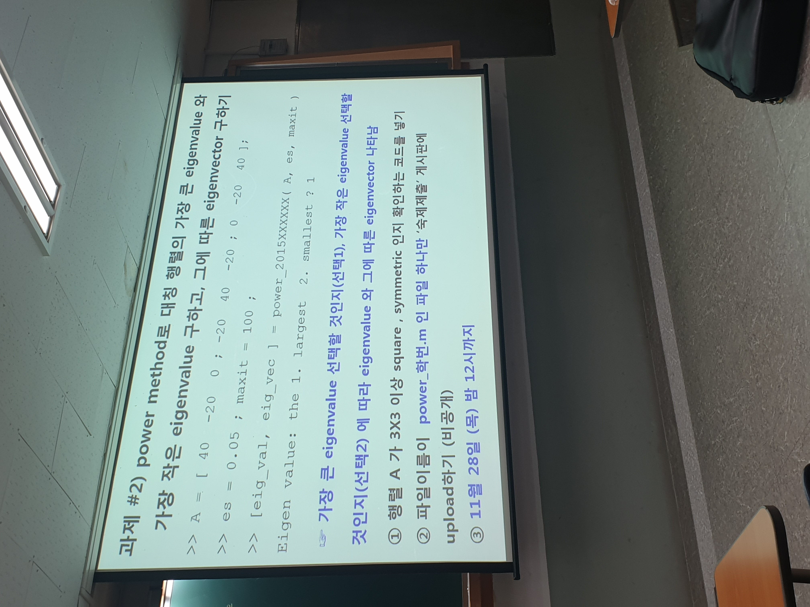

# 과제 2 Matlab Code

function [eig_val, eig_vec] = power(A, es, maxit)

if nargin<2 || isempty(es), es = 0.05; end

if nargin<3 || isempty(maxit), maxit = 100; end

sizetest = size(A);

if (sizetest(1) ~= sizetest(2)) || sizetest(1) < 3 || sizetest(2) < 3

    error ('Matrix A Must be square and Size have to be =>3');
    
end

if issymmetric(A) == false

    error ('Matrix A Must be Symmetric.');
    
end

x = ones(sizetest(1),1); % sizetest(1) = sizetest(2) 인건 검증되었으므로, 그에 맞는 초기열벡터를 만든다. 초기값은 1로.

iter = 1;

sel = input('Eigen value: 1. largest 2. smallest ? ');
switch sel
    case 1 % Max eigenvalue
        
    case 2 % Min eigenvalue
        A = inv(A);
    otherwise
        error ('Select correct number.');
end

        y = A * x;
        if abs(max(y)) >= abs(min(y))
            lamda = max(y);
        else
            lamda = min(y);
        end
        x = y / lamda ;
        while(1)
            if maxit == 1, break, end
            lamda_old = lamda;
            iter = iter + 1;
            y = A * x;
            if abs(max(y)) >= abs(min(y))
                lamda = max(y);
            else
                lamda = min(y);
            end
        x = y / lamda ;
        ea = abs( (lamda-lamda_old)/lamda );
        if ea <= es || iter >= maxit, break, end
        end

switch sel

    case 1 % Max eigenvalue
    
        eig_val = lamda;
        
        eig_vec = x;
        
    case 2 % Min eigenvalue
    
        eig_val = 1/lamda;
        
        eig_vec = x;
        
end

end
