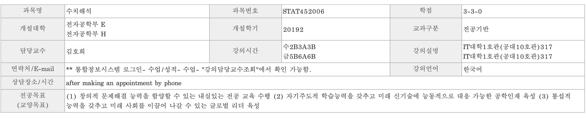
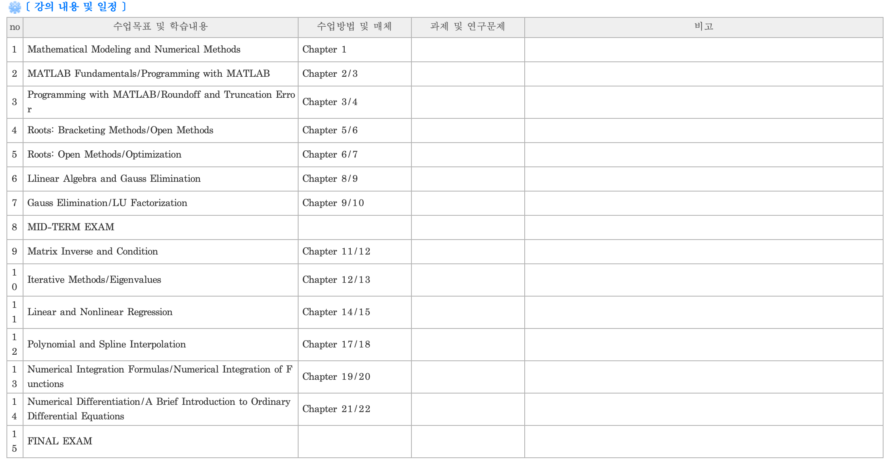

# 2019년도 2학기 : 수치해석 (STAT452006)

* ## [과제 솔루션 보기](Assignments/README.md)

* ## [메트랩 파일 보기](Matlab_Files)

* ## Repository 에 대한 설명

본 자료는 경북대학교 전자공학부 수업 중 2019년도2학기에 진행한 ‘김호희’ 교수님의 ‘수치해석’ 과목에 대한 정리이다.

상단의 폴더를 클릭하며 과제에 대한 설명과 해결 과정을 확인할 수 있다.

아래의 표는 이 과목이 어떤 식으로 진행이 되었는지에 대한 강의계획서이다.

# 과제 #1)

% 2017117876 김승현

function exp_2017117876(xmin,xmax,data,a,n)

x = linspace(xmin,xmax,data);

y = zeros(1,data);

for ncount=0:1:n

y = y + ((-1)^(ncount) * exp(-a) * (x-a).^ncount) / factorial(ncount);

end

plot(x,y, 'r--o','linewidth',3);

end

# 과제 #2)

% 2017117876 김승현

function [eig_val, eig_vec] = power_2017117876(A, es, maxit)

if nargin<2 || isempty(es), es = 0.05; end

if nargin<3 || isempty(maxit), maxit = 100; end

sizetest = size(A);

if (sizetest(1) ~= sizetest(2)) || sizetest(1) < 3 || sizetest(2) < 3

error ('Matrix A Must be square and Size have to be =>3');

end

if issymmetric(A) == false

error ('Matrix A Must be Symmetric.');

end

x = ones(sizetest(1),1); % sizetest(1) = sizetest(2) 인건 검증되었으므로, 그에 맞는 초기열벡터를 만든다. 초기값은 1로.

iter = 1;

sel = input('Eigen value: 1. largest 2. smallest ? ');

switch sel

case 1 % Max eigenvalue

case 2 % Min eigenvalue

A = inv(A);

otherwise

error ('Select correct number.');

end

y = A * x;

if abs(max(y)) >= abs(min(y))

lamda = max(y);

else

lamda = min(y);

end

x = y / lamda ;

while(1)

if maxit == 1, break, end

lamda_old = lamda;

iter = iter + 1;

y = A * x;

if abs(max(y)) >= abs(min(y))

lamda = max(y);

else

lamda = min(y);

end

x = y / lamda ;

ea = abs( (lamda-lamda_old)/lamda ) * 100;

if ea <= es || iter >= maxit, break, end

end

switch sel

case 1 % Max eigenvalue

eig_val = lamda;

eig_vec = x;

case 2 % Min eigenvalue

eig_val = 1/lamda;

eig_vec = x;
end

end
